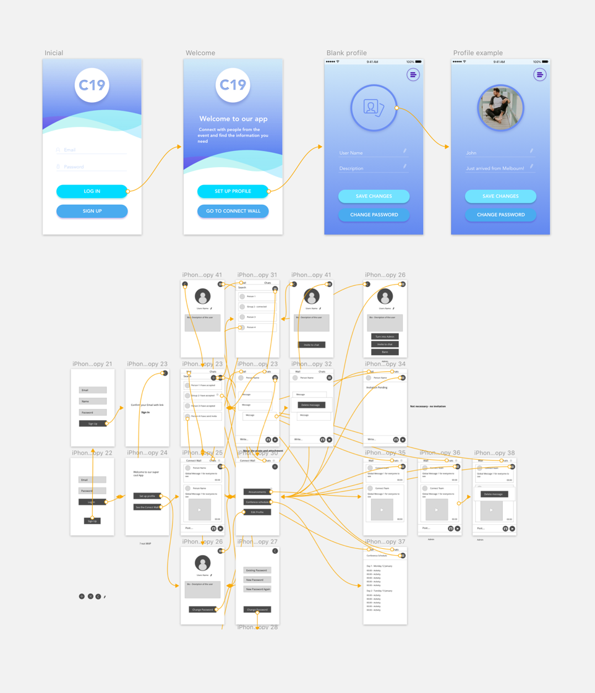
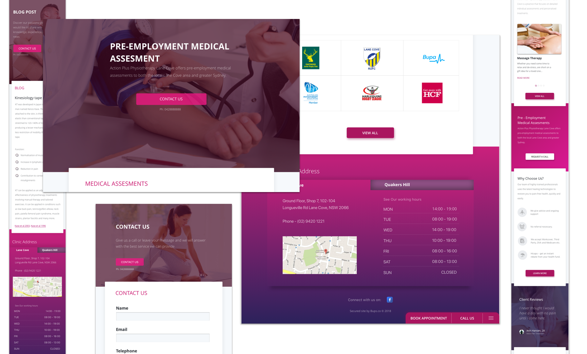

# Boutique data-first digital agency

## What we do

1. [Full stack web applications](#scalable-full-stack-web-applications)
2. [iOS and Android Apps](#ios-and-android-applications)
3. [Digital marketing, web design and development](#digital-marketing-strategy-web-design--development)

## Scalable Full Stack Web Applications

We build full stack web applications:

<iframe width="560" height="315" src="https://www.youtube.com/embed/hfGPJ2uNRt0" frameborder="0" allow="autoplay; encrypted-media" allowfullscreen></iframe>

Built with Postgres, Django, GraphQL, Vue.js. [Source Code](https://github.com/oLabHQ/role_model/blob/master/common/models.py)

## iOS and Android Applications

We do iOS and Android App UX Design, Graphics Design, and development:

Design built with Sketch.

## Digital Marketing Strategy, Web design & development

We integrate digital marketing strategy, design and development to scale mid-tier businesses.

For an ***Australian medical clinic group***, over the past year, ***we've increased their online and telephone leads by 20%*** through revamping their website, search engine optimisation & marketing, social media marketing.

***Since we've started working with them last year, their business has expanded by 20%.***

## Our Team

### Joined 2017

1. Bappy - Marketing & Business Consulting
2. Max - Design
3. Luca - Digital Marketing
4. Bhartendu - Engineering

### Joined 2018
1. Eric - Engineering

 

## [Start a conversation, send an email to eric@olab.com.au](mailto:eric@olab.com.au)
